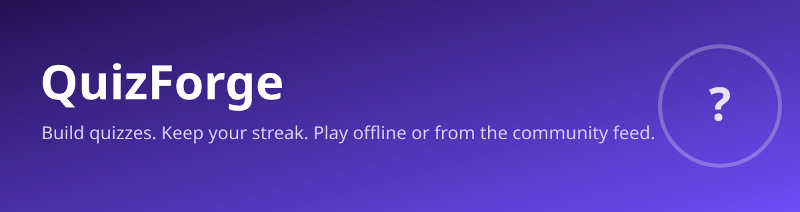

<p align="center">
  
</p>

<h1 align="center">Kvizo</h1>
<p align="center"><strong>A quiz app that looks good and works the way you'd expect.</strong></p>
<p align="center">
  
  
  
  
</p>

---

## **What is This?**

Kvizo is an Android quiz app built with Kotlin and Jetpack Compose. You write your own quizzes, take them in normal or timed mode, and watch your XP, streaks, and accuracy build up. Quizzes live on your device, so everything works offline. A signed community feed lets you pull in quizzes other people made without opening the door to tampered content.

It is not a backend-heavy SaaS. The app is the product. The `server/` folder is an optional companion: a tiny Node service that drives the admin panel, hosts community quizzes, and tracks which devices are currently online. You can ignore it and the app still does everything locally.

---

## **Feature List**

- **Custom quizzes** — multiple categories, difficulty (Easy/Medium/Hard), tags, and a time limit per quiz.
- **Timed mode** — race the clock or take it slow; your choice per attempt.
- **XP and levels** — `XpEngine` hands out XP for completion, correct answers, perfect runs, and answer streaks. Six level titles from Beginner to Quiz Master.
- **Streaks** — daily streaks with badges at 3, 7, 14, and 30 days.
- **Stats** — per-quiz accuracy, attempt history, and daily breakdowns.
- **Leaderboard** — device-local ranking today; the data model already has a spot for a global online board when the login system lands.
- **Community feed** — fetch signed quizzes from a URL, verify the Ed25519 signature, and import them. Cache is re-verified on every read.
- **Import** — bring quizzes in from `.txt`, `.json`, or `.csv`. The `.txt` parser handles multi-line questions and True/False (2 options) or MCQ (4 options).
- **Share codes** — export a quiz as a Base64 string and drop it into a message; the receiver decodes it back into a quiz.
- **Backup / restore** — one JSON file holds every profile, quiz, attempt, badge, and daily stat. Restore wipes and rebuilds the local DB in a single transaction.
- **Anime avatars + meme PFPs** — pick a profile picture from a bundled set.
- **Light / dark / system theme** — handled in `MainActivity` before the first frame.

---

## **What's Inside**

| Path | What it is |
|------|------------|
| `app/src/main/java/com/quizforge/app/data/` | SQLite models (`Entities.kt`), repository (`QuizRepository.kt`), settings, and the Ed25519 trust table (`CommunityKeys.kt`) |
| `app/src/main/java/com/quizforge/app/logic/XpEngine.kt` | XP math, level thresholds, streak calculation |
| `app/src/main/java/com/quizforge/app/ui/` | Compose screens, `AppViewModel`, theme |
| `app/src/main/java/com/quizforge/app/parsing/` | `TxtParser`, `QuizImporter` (JSON + CSV), and the `ParseException` contract |
| `app/src/main/java/com/quizforge/app/util/` | `BackupManager` (export/restore), `ShareCodec` (Base64 share codes), `Exporter` |
| `app/src/main/AndroidManifest.xml` | Single activity, FileProvider for share/export |
| `server/` | Optional Node companion: admin quiz API, heartbeat, static admin panel |
| `server/server.js` | Express app — public quiz list, `/api/heartbeat`, admin CRUD behind `x-admin-key` |
| `server/admin/index.html` | The admin panel UI served at `/admin` |
| `server/config.json` | `key` (admin) and `onlineWindowSeconds` (heartbeat window) |

---

## **Project Structure**

```
app/src/main/java/com/quizforge/app/
  data/        - Database, models, settings, Ed25519 keys
  logic/       - Quiz engine, scoring (XpEngine)
  ui/          - Screens, viewmodel, components, theme
  parsing/     - Txt / Json / Csv importers
  util/        - Backup manager, share codec, exporter
  MainActivity.kt - Entry point, navigation graph

server/
  server.js    - Express backend (admin + heartbeat)
  admin/       - Admin panel (static)
  config.json  - Admin key + online window
```

---

## **Building the App**

You need the Android SDK (API 34) and JDK 17.

```bash
git clone https://github.com/SirYadav1/kvizo.git
cd kvizo
./gradlew :app:assembleDebug
```

The debug APK lands at `app/build/outputs/apk/debug/app-debug.apk`.

Release builds minify and shrink with R8 (`app/build.gradle.kts` → `buildTypes.release`). Sign them with your own keystore; the debug signing config is used as a placeholder so the release task runs without one.

Version: `applicationId` `com.kvizo.app`, `versionName` 1.5.0, `minSdk` 26 (Android 8.0), `compileSdk` 34.

---

## **Community Quizzes (Ed25519)**

Community quizzes are fetched from `CommunityKeys.COMMUNITY_JSON_URL` (a GitHub Pages host) alongside a `.sig` file. The app:

1. Downloads `community.json` and `community.sig`.
2. Checks `expires_at` if present.
3. Looks up the `key_id` in `CommunityKeys.TRUSTED_KEYS`.
4. Verifies the Ed25519 signature over the JSON bytes.
5. Parses, caches the verified bundle, and imports new quizzes locally.

If the network fails, it falls back to the last verified cache. If the cache is missing or stale, the import fails loudly instead of trusting unverified data.

### Signing

The private key stays offline. The public key is hardcoded in `CommunityKeys.kt`. To sign a bundle:

```bash
# example signing step (run offline, with the private key on your machine)
python3 -c "
import ed25519
# sign community.json -> community.sig using your offline private key
"
```

Key rotation: add the new key as `CURRENT`, keep the old one as `PREV` for a 30-day grace window, then drop `PREV`. The `TRUSTED_KEYS` map already supports more than one key.

---

## **Running the Server (optional)**

```bash
cd server
npm install
node server.js
# listens on :3000
```

`config.json` holds `key` (the admin key sent as `x-admin-key` header) and `onlineWindowSeconds` (how long a heartbeat counts a device as online). The admin panel is served at `/admin`; public quizzes at `/api/quizzes`; device heartbeats at `/api/heartbeat`.

---

## **Import Formats**

**`.txt`** — numbered questions, lettered options, an `Answer:` line:

```
1. What is 2 + 2?
a) 3
b) 4
c) 5
d) 6
Answer: b
```

**`.json`** — `{ "title": "...", "questions": [ { "questionText": "...", "optionA": "...", "correctOption": "a" } ] }`, or a bare array. Short aliases (`q/a/b/c/d/ans`) work too.

**`.csv`** — header row `question,option_a,option_b,option_c,option_d,answer`. Answers may be a letter or the exact option text. `option_c`/`option_d` can be blank for True/False.

---

## **Security Notes**

- Community quizzes are verified with Ed25519 before they touch the database. The private key never ships in the repo.
- Admin endpoints require `x-admin-key`; the key lives in `server/config.json` (change it before deploying).
- Quiz text is stripped of HTML and control characters on import (`sanitizeText` in `CommunityQuizManager`).
- Backups are plain JSON — keep the export file private, anyone with it can restore your profiles and scores.

---

## **Author**

Yadav — [@SirYadav1](https://github.com/SirYadav1)

## **License**

MIT — see [LICENSE](LICENSE).
